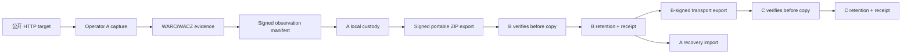

# OIN Local Network Demo Architecture

## 1. 目标与边界

本实现不是新的归档格式、哈希算法、密码学算法或全球 discovery 协议。它使用现有 OIN MVP 的 HTTP capture、WARC/WACZ、SHA-256、Ed25519 和离线验证组件，构造三个未来可拆分的 Operator 边界。重点是验证完整链路是否能运行：证据在某个 Operator 消失后仍由其他 Operator 以可验证方式保留，新 Operator 又能经由 export/import 接入。

本项目的三个当前目录是 `operator-a`、`operator-b` 与 `operator-c`。实际测试在同一 sandbox 内进行，因此所有有关“独立”的结论均限于**密钥、目录、导入接口和签名边界的本地模拟**。



## 2. Operator 模型与数据隔离

每个 Operator root 都包含以下逻辑区域：

| 区域 | 内容 | 私有性/可交换性 |
| --- | --- | --- |
| `identity/` | 本地 operator ID 与 observer ID。 | 本地 metadata；可发布其公开部分。 |
| `keys/` | Ed25519 私钥 PEM 与公开 key document。 | 私钥绝不 export；公开 key 可以 export。 |
| `descriptors/` | 描述 Operator capabilities、公开密钥、endpoint 与 revision 的 descriptor。 | 可发布。 |
| `captures/` | HTTP capture record。 | 本地记录。 |
| `evidence/` | 离线 bundle：manifest、WACZ/WARC、原始 signer 公钥与 evidence metadata。 | 可以作为 export 的内容。 |
| `manifests/`、`statements/` | 对 evidence manifest 的本地索引。 | 可重建；不当作唯一证据。 |
| `verification-results/` | 每次本地验签/绑定检查的结果。 | 本地审计记录。 |
| `replication-records/` | import acceptance/rejection receipt。 | 本地 custody 记录。 |
| `exports/`、`imports/` | 可移植 transport ZIP 与其本地副本。 | 可交换 artifact / 本地收件记录。 |
| `recovery/` | 离线模拟 marker 和 recovery receipt。 | 本地演练记录。 |

B 和 C 的 import 入口接受**一个 transport ZIP 文件**，而非对 A/B 目录的读取权限。导入器在内存/临时 staging 中验证 archive，只有验证通过后才会向自己的 `evidence/` 写入副本。失败导入只写 `REJECTED` receipt，不写入可接受 custody store。

## 3. Evidence 生命周期

### 3.1 Capture

`operator.py capture` 调用现有 `oin.capture.http_capture.capture_url`。它对 HTTP/HTTPS target 做公开地址检查，限制 redirect、response size 和 timeout，并记录 requested URL、observed URL、capture time、HTTP status、headers、redirect chain 和 body。HTTP 404 是可被记录的 HTTP observation，不等同于 capture 失败；timeout 与不可达 target 会给出独立状态。

### 3.2 WARC/WACZ

capture 生成 WARC request/response record；默认 WACZ 包保存 `archive/data.warc`、`pages/pages.jsonl`、`datapackage.json` 和 `datapackage-digest.json`。WACZ 的 `datapackage.json` 含 file-level SHA-256 digest。evidence bundle 将以下文件并列保存：

```text
observation.json       # 已签名 observation manifest
raw.wacz               # WARC/WACZ evidence
observer-public.json   # 原始 evidence signer 公钥
 evidence.json         # 当前为 local timestamp declaration
```

evidence hash 与 manifest hash 是不同概念。archive hash 绑定整个 WACZ/WARC 字节；raw content hash 绑定从 WARC response record 提取的 HTTP response payload。

### 3.3 Observation manifest

现有 MVP manifest 把 canonical URL、object ID、HTTP metadata、archive hash、raw payload hash、observer identity、capture assertion scope 和 Ed25519 signature 绑定起来。`observation_id` 是移除 `signature` 与 `observation_id` 后 canonical JSON 的 SHA-256。签名载荷是保留 `observation_id`、移除 `signature` 后的 canonical JSON。

> Ed25519 签名证明：持有该私钥的 signer 对该 manifest 内容作出过声明，并且当前字节仍与签名匹配。它不证明网页文字、网页作者、网页内容的客观事实或 capture time 已被第三方独立见证。

## 4. Signing 模型

签名主体必须分开：

| 签名/声明 | Signer | 绑定的内容 | 不证明什么 |
| --- | --- | --- | --- |
| Observation manifest | 原始 capture Operator，例如 A。 | capture metadata 与 WARC/WACZ hash。 | 网页内容为真。 |
| Operator descriptor | 当前演示只发布 JSON；实际生产应由 descriptor issuer 签名。 | Operator key、capabilities、revision。 | Operator 真实独立或长期可用。 |
| Export manifest | 当前 transport exporter，例如 A、B 或 C。 | export 文件清单、源 Operator、exporter key、原始 issuer、artifact 与 descriptor digest。 | exporter 是原始网页 observer。 |
| Replication receipt | 当前 importer/custodian。 | 导入时间、source、验证结论与保留的 artifact identity。 | source 永久保存或任何内容为真。 |

多跳复制时，B 可以签署自己的 export manifest，C 验证的 exporter public key 也应是 B 的 key；但 bundle 内 `observer-public.json` 仍是 A 的原始 observation signer key。`original_issuer` 由原始 observation manifest 决定，B/C 无权覆盖。

## 5. Import、replication 与 recovery

### 5.1 Portable export

transport ZIP 是普通 ZIP 容器，不是新的 evidence 标准。它包含：

```text
bundle/observation.json
bundle/raw.wacz | bundle/raw.warc
bundle/observer-public.json
bundle/evidence.json                 # 若存在
operator-descriptor.json
exporter-public.json
export-manifest.json
export-signature.json
```

import verifier 检查 outer ZIP member 路径、export manifest signature、descriptor/exporter public key binding、descriptor digest、每个 bundle file digest、原始 manifest signature、archive hash、WACZ resource hash、WARC response payload hash、object ID 与 canonical URL。检验通过后才复制到本地 custody。

### 5.2 Replication receipt

每个 import 都生成 JSON receipt。成功 receipt 使用 `ACCEPTED`，至少包含：

```json
{
  "original_artifact_digest": "sha256:…",
  "original_issuer": "oin:observer:sha256:…",
  "importer": "did:oin-local:operator-b",
  "custodian": "did:oin-local:operator-b",
  "replica": "did:oin-local:operator-b",
  "source": {"transport": "file", "export_digest": "sha256:…"},
  "verification_result": {"status": "VERIFIED"},
  "retained_artifact_identity": {"relative_path": "evidence/...", "artifact_digest": "sha256:…"}
}
```

失败 receipt 使用 `REJECTED` 并携带 `INVALID_SIGNATURE`、`INVALID_BINDING`、`MALFORMED_ARTIFACT` 或 `NOT_FOUND` 等原因。对还无法从畸形输入中识别的 original fields，失败 receipt 可为 `null`；它没有被接受为 custody evidence。

### 5.3 Recovery

恢复并不把 A 的旧存储重新视为唯一来源。`recover` 接受 B 或 C 的 verified export，并使用正常 import 流程重建 A 的本地 bundle；之后写 `RECOVERED` receipt，保留 source export digest、original issuer、artifact digest 和引用的 replication record。恢复演练必须先实际移除或隔离 A 的 evidence/manifest material，才能称为 evidence-loss recovery test。

## 6. Discovery 与 descriptor

当前 discovery 边界是一个可独立发布的 `operator-descriptor.json`，字段包括：

```json
{
  "operator_id": "did:oin-local:operator-a",
  "descriptor_revision": 1,
  "public_key": {"algorithm": "Ed25519", "key_id": "…", "public_key_base64": "…"},
  "capabilities": ["capture-http", "verify-offline", "export-bundle", "import-bundle", "history-view", "recovery"],
  "supported_artifact_types": ["application/wacz", "application/warc", "application/zip"],
  "endpoint": {"transport": "file", "base_url": "…"}
}
```

文件 transport 使演示可在单机运行。未来可将 `endpoint` 替换为 HTTPS object storage、static catalog 或 API；并可在不改变 evidence/manifest/receipt 模型的条件下增加 WebFinger、DID、HTTP Link 或其他 discovery 方法。当前不把 descriptor 当作全球 trust registry，也不声明已解决 global discovery。

## 7. History View 与范围语义

History View 输入 target 和明确的 `declared_scope`。每个 scope member 只能产生以下局部结论：可查询、不可用、或此目录无匹配。对匹配 item，History View 再执行本地离线 verifier 并列出：observation ID、issuer、capture time、artifact digest、verification status、evidence reference、operator custody、original issuer 和 replica。

| 汇总状态 | 条件 | 不允许推断 |
| --- | --- | --- |
| `VERIFIED` | 有有效 statement，且没有不同有效 artifact digest。 | 全网只有一个历史。 |
| `CONFLICT` | 同一 target 存在不同有效 archive digest。 | 哪个 statement 对事实更真。 |
| `PARTIAL_SCOPE` | 有 Operator 不可用，或仅有缺失/无效副本。 | 当前 scope 已完整。 |
| `NO_MATCH_IN_DECLARED_SCOPE` | 所有列明可查询 Operator 中无匹配。 | 互联网或未查询网络中无历史。 |
| `UNAVAILABLE_OPERATOR` | 全部列明 Operator 都不可用。 | 没有历史。 |

当前冲突检测按不同有效 **archive digest** 触发。因此两次 capture 即使 response body 未变，也可因 WARC metadata、capture time 或 archive byte differences 而显示 divergence。它是“不同的可验证 observation artifact”，不是内容事实裁决器。

## 8. 独立 verifier

Python offline verifier 来自现有 MVP。`node_verifier.mjs` 不调用 Python 包，不复用 Python verifier 代码；它独立实现：ZIP central directory 读取、stored/deflate ZIP member 读取、WACZ resource digest、WARC response payload 提取、canonical JSON、object/observer/observation identifier、Ed25519 raw public key/SPKI 验签与 export signer binding。

互操作验证包括 Python-produced bundle → Node verifier、Python-produced export → Node verifier、Node-produced export → Python importer/verifier。

## 9. Threat model 与当前限制

| 威胁/失败 | 当前控制 | 未解决部分 |
| --- | --- | --- |
| evidence 或 WACZ 字节遭篡改 | archive hash、WACZ resource digest、WARC payload hash、签名验证。 | 不阻止攻击者删除所有副本。 |
| manifest 或签名遭篡改 | observation ID 与 Ed25519 verification。 | 不证明 signer 当时诚实。 |
| 传输 ZIP 替换或 descriptor 改动 | export signature、digest 与 key/descriptor binding。 | 仍需真实 trust policy 决定哪些 Operator key 被接受。 |
| 单一 Operator 离线 | B/C receipt 与 portable recovery import。 | 当前仅验证本地目录隔离，不是跨组织故障。 |
| 复制者伪称自己是原始 issuer | bundle 原始 signer 与 exporter signer 分离，receipt 记录角色。 | 无法证明 Operator 背后自然人/组织身份。 |
| 网页动态行为未捕获 | 明确限制为 HTTP GET。 | 需要独立 browser capture/QA 设计。 |
| 不存在的记录 | `NO_MATCH_IN_DECLARED_SCOPE`。 | 未查询 Operator、私有集合和未来 capture 均未知。 |
| 冲突内容 | 保留全部 artifact。 | 不提供事实裁决或仲裁。 |

## 10. 真实部署所需但尚未证明的内容

要从本地机制测试升级为真实独立 Operator network，至少还需：不同法律主体和账户、独立私钥与密钥轮换、独立存储/备份、HTTPS transport、可签名和可撤销的 descriptor publication、明确 content/access/takedown policy、长期 retention 与资金责任、真实 outage/recovery drill、operator acceptance policy、安全审计和隐私治理。没有这些条件时，不能把本实现描述为已去中心化的公共网络。
